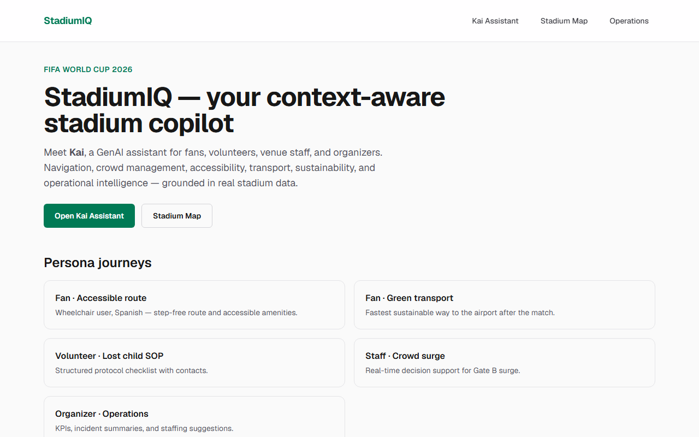
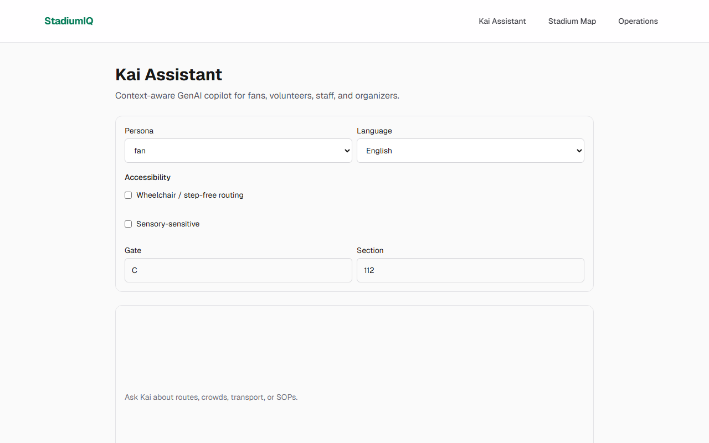
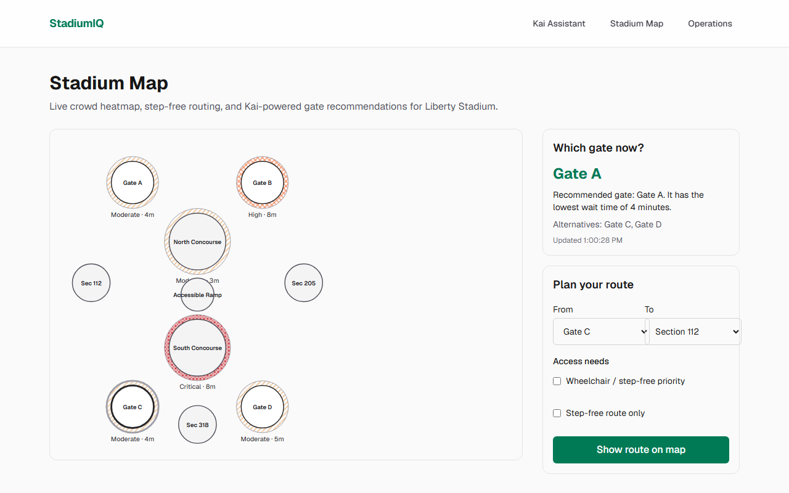
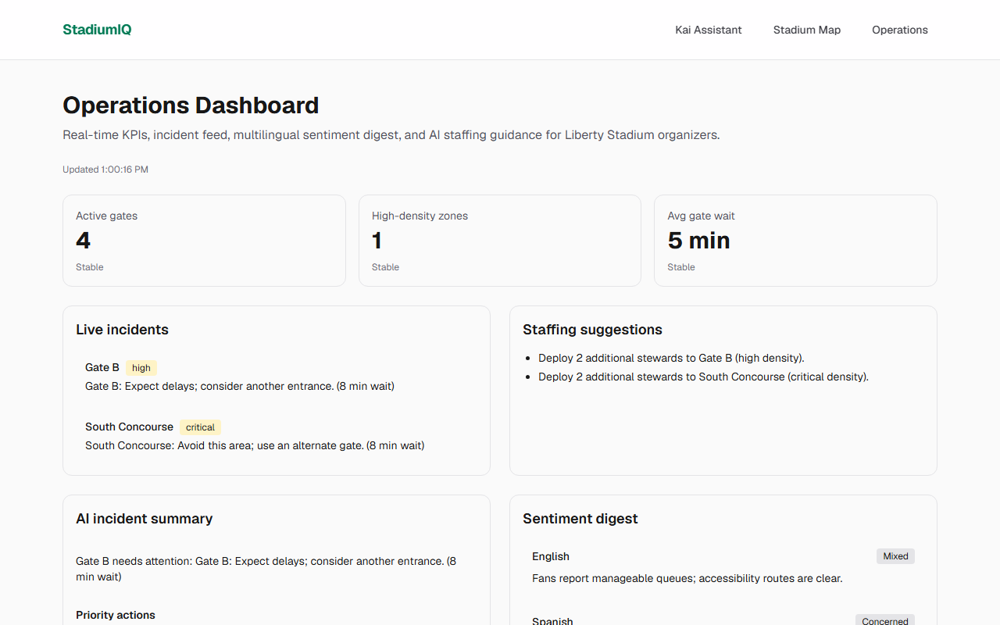
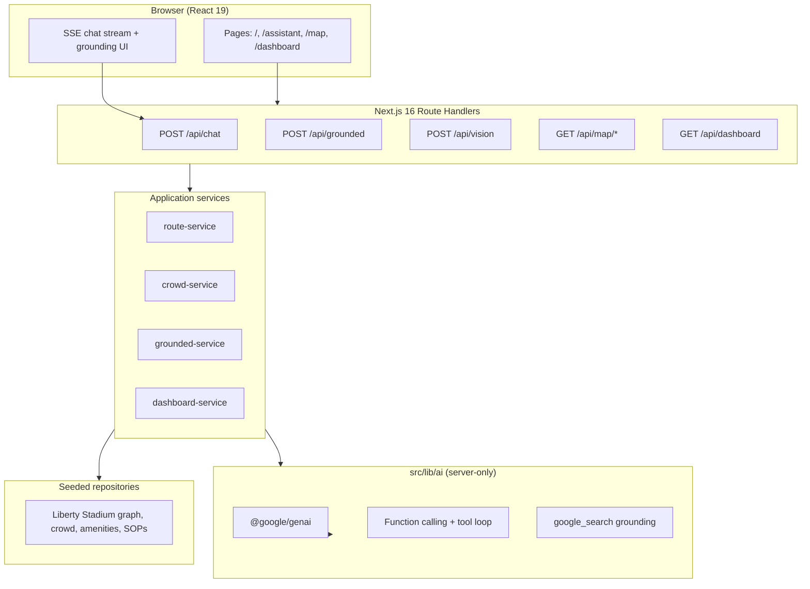

# StadiumIQ

[](https://github.com/priyanshuchawda/stadiumiq/actions/workflows/ci.yml)
[](https://github.com/priyanshuchawda/stadiumiq/actions/workflows/codeql.yml)
[](https://github.com/priyanshuchawda/stadiumiq/actions/workflows/lighthouse.yml)
[](./LICENSE)
[](./tsconfig.json)
[](./vitest.config.ts)

**GenAI stadium operations & fan experience platform for FIFA World Cup 2026**

StadiumIQ is an enterprise-grade web application that pairs a role-aware AI copilot (**Kai**) with live operational dashboards. It helps **fans, volunteers, venue staff, and organizers** navigate venues, manage crowds, plan accessible routes, find transport, and make real-time operational decisions — using **Google Gemini** (tools, streaming, grounding, multimodal) on a **free-tier, production-shaped** Next.js stack.

**Author:** Priyanshu Chawda  
**Live app:** [stadiumiq-mauve.vercel.app](https://stadiumiq-mauve.vercel.app/)  
**Repository:** [github.com/priyanshuchawda/stadiumiq](https://github.com/priyanshuchawda/stadiumiq)

---

## Screenshots

|                                                                           |                                                                       |
| ------------------------------------------------------------------------- | --------------------------------------------------------------------- |
| **Home — persona journeys**             | **Kai Assistant**         |
| **Stadium Map — live heatmap + routing**  | **Operations Dashboard**  |

---

## Chosen vertical

**Stadium operations & tournament fan experience (FIFA World Cup 2026)**

We chose this vertical because it combines high-stakes **real-time decision support** with measurable **accessibility, crowd, and transport** problems — a natural fit for a context-aware GenAI assistant that must not hallucinate venue facts.

| Problem area                   | StadiumIQ capability                                                          |
| ------------------------------ | ----------------------------------------------------------------------------- |
| **Navigation**                 | Step-free indoor routing (Dijkstra over seeded graph), SVG map, route overlay |
| **Crowd management**           | Simulated live density heatmap, gate recommendations by wait + mobility       |
| **Accessibility**              | `UserContext.accessibility` drives step-free routes, gate logic, and prompts  |
| **Transportation**             | Grounded Google Search answers + seeded eco-scoring fallback                  |
| **Multilingual assistance**    | Language in context; Spanish persona journey; multilingual sentiment digest   |
| **Operational intelligence**   | Organizer dashboard: KPIs, incidents, AI summaries, staffing suggestions      |
| **Real-time decision support** | Staff/volunteer copilot with tools + SOPs + crowd status                      |

**Flagship venue:** _Liberty Stadium_ (fictional MetLife-style venue) with gates A–D, concourses, sections, amenities, and time-varying simulated crowd data.

---

## Approach and logic

### Design principles

1. **Context-first intelligence** — Every Kai request carries a typed `UserContext` (persona, language, accessibility, location, ticket type, time-to-kickoff, weather). The same question with different context must yield **different, correct** answers (covered by unit tests).
2. **Ground facts in tools or search** — Stadium data never comes from model imagination. Kai calls **function tools** against seeded repositories, or **Google Search grounding** for live transport/news — with mandatory citations in the UI.
3. **Server-only AI** — Gemini runs exclusively in Route Handlers / server modules (`import "server-only"`). The API key never reaches the browser.
4. **Validate every boundary** — Zod `.strict()` on all inputs and AI structured outputs; repair once, then fallback.
5. **Graceful degradation** — Missing API key, rate limits, or provider errors show clear UI messages and **cached/seed fallbacks** so the experience never crashes.
6. **Security by default** — Rate limiting, CSP, https-only citation links, sanitized grounding HTML, prompt-injection mitigations ([`SECURITY.md`](./SECURITY.md)).

### Decision logic (examples)

| User signal                             | System behavior                                                        |
| --------------------------------------- | ---------------------------------------------------------------------- |
| `mobility: wheelchair`                  | Step-free graph edges only; gate scoring penalizes non-step-free gates |
| `topic=transport` or transport keywords | Route to `/api/grounded` (Google Search) instead of tool-only chat     |
| `persona: volunteer/staff`              | SOP tool + operational tone in system prompt                           |
| High density at Gate B                  | Incident feed + staffing suggestion to deploy stewards                 |
| Missing `GEMINI_API_KEY`                | Banner + offline fallbacks for chat, grounding, and dashboard AI       |

### Architecture (layered)



---

## How the solution works

### 1. Kai Assistant (`/assistant`)

- User sets **persona, language, accessibility, location** in the context panel.
- Messages go to `POST /api/chat` (SSE stream) unless the intent is transport/real-time → then `POST /api/grounded`.
- **Tool loop:** Gemini may call `getRoute`, `getCrowdStatus`, `getTransportOptions`, `getAmenities`, `getSOP`. The server executes tools against seeds, returns JSON, and the model composes the final answer.
- **Vision:** Photo upload → `POST /api/vision` → multimodal Gemini for sign/menu translation.
- **UI:** Streaming tokens with `aria-live`; grounding responses show `<GroundingCitations />` and sanitized `<SearchSuggestions />`.

### 2. Stadium Map (`/map`)

- Custom **SVG schematic** with seeded coordinates (no paid map API).
- **Crowd heatmap** uses SVG patterns + text labels (not color-only) and refreshes every 60s.
- **Route overlay** from Dijkstra pathfinding; step-free toggle respects wheelchair context.
- **Which gate now?** — `recommendGate()` scores gates by wait + step-free need; Kai (`flash-lite`) explains the recommendation.

### 3. Operations Dashboard (`/dashboard`)

- **KPIs:** active gates, high-density zones, average wait.
- **Incident feed:** areas with high/critical density.
- **Staffing suggestions:** rule-based deployment hints from incidents.
- **AI summaries:** Gemini structured JSON (Zod-validated) for incident summary + multilingual **sentiment digest**; offline fallback when no API key.

### 4. Data & “live” feel

Crowd density **simulates** time-varying offsets from deterministic seeds — powering heatmaps, gate logic, and dashboards without paid feeds. Repositories are interface-backed for a straightforward future DB/API swap.

---

## Assumptions made

Every assumption below is a **deliberate, documented design decision** — chosen to keep the platform verifiable, reproducible, and free to run, while keeping a clear path to production scale.

| Assumption                                                             | Why it strengthens the solution                                                                                                                                                                                      |
| ---------------------------------------------------------------------- | -------------------------------------------------------------------------------------------------------------------------------------------------------------------------------------------------------------------- |
| **Venue is an original seeded dataset** (_Liberty Stadium_, gates A–D) | Guarantees the AI is always graded against a known ground truth — hallucinations are detectable and tested for. Repositories are interface-backed, so swapping in a real venue feed is a data change, not a rewrite. |
| **Crowd density is simulated deterministically** (time-varying seeds)  | Gives evaluators a realistic, always-alive experience with zero paid feeds, and makes behavior snapshot-testable — the same inputs always produce the same operational picture.                                      |
| **No user accounts or PII**                                            | Fan context (persona, language, accessibility) is session-scoped by design. This maximizes privacy — there is nothing to breach — while `UserContext` remains fully typed and ready for an identity provider.        |
| **Gemini free tier is the AI budget**                                  | Forced efficient engineering that judges can reproduce: model tiering (`flash` / `flash-lite`), capped output tokens, 60s caches with in-flight dedup, and a multi-model fallback chain.                             |
| **AI can be unavailable at any moment**                                | Treated as a first-class state, not an error: every AI feature has a deterministic, context-aware fallback, so the platform is fully evaluable with **zero credentials**.                                            |
| **Single-instance in-memory rate limiting & caches**                   | Correct for Vercel's per-instance model at this scale, with eviction to bound memory; the guard interfaces are one adapter away from Redis for multi-region scale ([`SECURITY.md`](./SECURITY.md) §6).               |
| **English, Spanish, French, and Arabic-ready multilingual surface**    | Language flows through context into prompts, `lang`/`dir` attributes, and the sentiment digest — adding a language is configuration, not code.                                                                       |

---

## Quick start

### Prerequisites

- **Node.js 22 LTS** (npm ships with it)

### Setup

```bash
git clone https://github.com/priyanshuchawda/stadiumiq.git
cd stadiumiq
npm install
cp .env.example .env.local
```

Get a **free** Gemini API key from [Google AI Studio](https://aistudio.google.com/apikey) and set:

```env
GEMINI_API_KEY=your_key_here
```

> **Zero-key mode:** the app runs fully **without** an API key — every AI feature degrades to deterministic, context-aware fallbacks (routes, gate advice, SOPs, transport eco-scoring), so you can evaluate everything with no credentials.

### Run

```bash
npm run dev
```

Open [http://localhost:3000](http://localhost:3000).

Production build:

```bash
npm run build
npm start
```

---

## Guided tour (5 persona journeys)

Each journey is **one click** from the home page journey cards — try them live at [stadiumiq-mauve.vercel.app](https://stadiumiq-mauve.vercel.app/).

| #   | Persona                   | Path                                     | What to show                                                                   |
| --- | ------------------------- | ---------------------------------------- | ------------------------------------------------------------------------------ |
| 1   | Fan (wheelchair, Spanish) | `/assistant?persona=fan&lang=es`         | Ask for step-free route + accessible restroom; note Spanish + context          |
| 2   | Fan (green transport)     | `/assistant?persona=fan&topic=transport` | Ask _“Fastest greenest way to the airport now?”_ → grounded answer + citations |
| 3   | Volunteer                 | `/assistant?persona=volunteer`           | Ask about lost-child protocol → SOP tool checklist                             |
| 4   | Staff                     | `/assistant?persona=staff`               | Ask about Gate B crowd surge → crowd tool + recommendations                    |
| 5   | Organizer                 | `/dashboard`                             | KPIs, incidents, sentiment digest, staffing suggestions                        |

**Also try:** `/map` for heatmap + step-free routing; photo upload in assistant for sign translation.

---

## Testing & quality gates

```bash
npm run typecheck              # TypeScript strict
npm run lint                   # ESLint 9 + a11y + security, zero warnings
npm test                       # Vitest unit + component
npm run test:behavior          # MSW-driven AI behavior baselines (snapshots)
npm run test:behavior:update   # Update baselines after intentional changes
npm run test:perf              # Routing/gate performance baselines
npm run test:e2e               # Playwright — 5 journeys + core pages
npm run test:a11y              # axe — WCAG 2.x on key routes
npm run coverage               # Coverage thresholds on core services
npm audit                      # No high/critical vulnerabilities
```

Live Gemini smoke test (optional, uses your key):

```bash
# PowerShell
$env:GEMINI_LIVE_TEST="true"; npm run test:live
```

CI runs on every push to `main` (see [`.github/workflows/ci.yml`](./.github/workflows/ci.yml)): a cross-OS matrix (Ubuntu + Windows) for typecheck/lint/test/coverage/build, a Playwright e2e + a11y job, and a `/api/health` smoke job. Static analysis via **CodeQL** and dependency updates via **Dependabot** run alongside it.

### Resilience & liveness

- **Multi-model fallback** — each request tries an ordered Gemini model chain; a model that returns transient errors is put in cooldown (honoring `Retry-After`), and a model-not-found/4xx is skipped permanently, so the request degrades to the next model instead of failing (`src/lib/ai/model-fallback.ts`).
- **Health probe** — `GET /api/health` returns status, AI mode (`live` vs `fallback`), and the resolved model chains (no secrets). Used by the CI smoke job.

---

## Evaluation criteria mapping

Every claim below is verifiable in the repo — file paths included.

| Criterion                     | Evidence                                                                                                                                                                                                                                                                                                                                            |
| ----------------------------- | --------------------------------------------------------------------------------------------------------------------------------------------------------------------------------------------------------------------------------------------------------------------------------------------------------------------------------------------------- |
| **Smart dynamic assistant**   | Shared function-calling loop with circuit breaker (`src/lib/ai/tool-loop.ts`), SSE streaming (`src/lib/ai/stream-kai.ts`), Google Search grounding with citations (`src/lib/ai/grounded-search.ts`), multimodal vision (`src/app/api/vision/`)                                                                                                      |
| **Logical context decisions** | Typed `UserContext` drives prompts, tool results, gate scoring, and routing; divergence covered by tests (`tests/unit/ai-fallbacks.test.ts`, `tests/behavior/`)                                                                                                                                                                                     |
| **Code quality**              | TypeScript strict + `exactOptionalPropertyTypes`, one-way layering (`ui → route → service → ai/data`), ESLint complexity caps at zero warnings, single tool-loop source of truth                                                                                                                                                                    |
| **Security**                  | DOMPurify twice (server + render boundary), per-request nonce CSP (`src/proxy.ts`), rate limits on all 6 AI routes with bucket eviction, origin allowlist, body-size caps, strict Zod at every trust boundary — threat model in [`SECURITY.md`](./SECURITY.md)                                                                                      |
| **Testing**                   | **197 tests** across unit / component / MSW integration / behavior snapshots / perf baselines, coverage gate **enforced in CI** (96% stmts / 86% branches / 98% funcs), Playwright e2e journeys + **axe** a11y job, deterministic Gemini fake (`tests/mocks/fake-gemini.ts`)                                                                        |
| **Accessibility**             | Keyboard-operable SVG map (one tab stop per node), **screen-reader-safe streaming** (tokens silent, finished reply announced once — `chat-message-list.tsx`), skip link, `lang`/`dir` on multilingual content, `forced-colors` + `prefers-reduced-motion` + `prefers-contrast` support, axe clean                                                   |
| **Efficiency**                | Tool-loop answer reused for streaming (no duplicate model call), 60s AI caches with in-flight dedup (`src/lib/ai/async-cache.ts`), multi-model fallback with health cooldowns, `flash-lite` for cheap tasks, capped output tokens, SSR-first pages, **Lighthouse gates in CI** — measured numbers in [`docs/performance.md`](./docs/performance.md) |
| **Usability**                 | 5 persona journeys ≤1 click from home, graceful fallbacks for every failure mode, clear empty/error states                                                                                                                                                                                                                                          |

---

## Project structure (high level)

```
src/
├── app/                 # Routes & API handlers
├── components/          # UI (ai/, map/, dashboard/, layout/)
├── lib/ai/              # Gemini client, tools, grounding, prompts (server-only)
├── lib/validation/      # Zod schemas
├── server/services/     # Business logic
├── server/data/         # Seeds & routing
└── types/               # Domain & API types
```

---

## Tech stack

| Layer      | Choice                                              |
| ---------- | --------------------------------------------------- |
| Framework  | Next.js 16 (App Router), React 19.2                 |
| Language   | TypeScript (strict)                                 |
| Styling    | Tailwind CSS v4                                     |
| AI         | `@google/genai` — `gemini-2.5-flash` / `flash-lite` |
| Validation | Zod 4                                               |
| Tests      | Vitest 4, Playwright, axe-core, MSW                 |
| CI         | GitHub Actions (Node 22), CodeQL, Dependabot        |
| Deploy     | Vercel (Next.js native)                             |

---

## Deployment (Vercel)

The app is a standard Next.js 16 App Router project with no external services required (no Firebase/DB) — it runs on Vercel out of the box.

```bash
# One-time
npm i -g vercel        # if not already installed
vercel login

# From the project root
vercel                 # create/link project + preview deploy
vercel --prod          # production deploy
```

Set the environment variable in the Vercel dashboard (Project → Settings → Environment Variables) or via CLI:

```bash
vercel env add GEMINI_API_KEY
```

Notes:

- AI routes (`/api/chat`, `/api/vision`, `/api/grounded`) run on the Node.js runtime with `maxDuration = 30` for streaming/vision headroom.
- Security headers ship via `next.config.ts`; the per-request nonce CSP ships via `src/proxy.ts` (Vercel-compatible middleware).
- Without `GEMINI_API_KEY`, every AI feature still works via deterministic fallbacks — safe for preview deploys.

---

## License & attribution

Released under the [MIT License](./LICENSE).  
Built for FIFA World Cup 2026 stadium operations.  
Operational map data and venue layout are **original seeded datasets** created for this project, not official FIFA or venue data.

For architecture and request lifecycles see [`docs/architecture.md`](./docs/architecture.md). For measured performance see [`docs/performance.md`](./docs/performance.md). For security details see [`SECURITY.md`](./SECURITY.md). For test layout see [`tests/README.md`](./tests/README.md). For operations see [`docs/operations-runbook.md`](./docs/operations-runbook.md).
