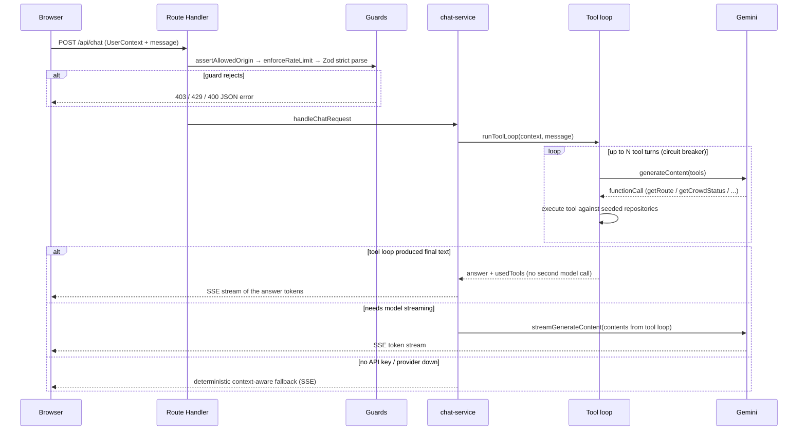

# StadiumIQ — Architecture

This document explains how a request flows through the system, where the trust
boundaries sit, and why the layers are shaped the way they are. For the threat
model see [`SECURITY.md`](../SECURITY.md); for operations see
[`operations-runbook.md`](./operations-runbook.md).

## Layering rules

Dependencies point one way only:

```
UI components → Route Handlers → Services → AI / Data
```

- **`src/components/`** — React UI. Never imports AI or data modules directly.
- **`src/app/api/`** — Route Handlers. Thin: origin check → rate limit → Zod
  parse → delegate to a service.
- **`src/server/services/`** — Business logic. Composes data repositories and
  AI modules; returns typed results.
- **`src/lib/ai/`** — Gemini client, tool loop, grounding, prompts. Marked
  `import "server-only"` so a client bundle can never include the API key.
- **`src/server/data/`** — Seeded repositories (Liberty Stadium graph, crowd,
  amenities, SOPs) behind interfaces, so a real venue feed is a data swap.

`import/no-cycle` is enforced by ESLint, and every boundary input is validated
with Zod `.strict()`.

## Chat request lifecycle (`POST /api/chat`)



Key properties:

- **Single tool-loop source of truth** (`src/lib/ai/tool-loop.ts`): both the
  blocking and streaming paths reuse the same loop outcome, so a resolved
  answer is never generated twice.
- **Multi-model fallback** (`src/lib/ai/model-fallback.ts`): an ordered model
  chain with per-model cooldowns (honoring `Retry-After`); 4xx model errors are
  skipped permanently, transient errors trigger cooldown.
- **Zero-key mode**: every AI feature has a deterministic fallback, so the app
  is fully evaluable without credentials.

## Grounded transport queries (`POST /api/grounded`)

Transport/real-time questions route to Google Search grounding instead of the
tool loop. Responses carry citations; the rendered search-suggestion HTML is
sanitized with DOMPurify **twice** — once server-side
(`src/lib/utils/sanitize-grounding-html.ts`) and again at the render boundary
(`src/components/ai/search-suggestions.tsx`).

Results are cached for 60s in an `AsyncCache` (`src/lib/ai/async-cache.ts`)
keyed by language + persona + mobility + normalized query, with **in-flight
deduplication** so concurrent identical requests share one Gemini call.

## Security guards (all AI routes)

| Guard                               | Module                                                                     | Applied to             |
| ----------------------------------- | -------------------------------------------------------------------------- | ---------------------- |
| Origin allowlist                    | `src/server/http/origin-check.ts`                                          | POST AI routes         |
| Token-bucket rate limit + eviction  | `src/server/security/rate-limit.ts`, `src/server/http/rate-limit-guard.ts` | all 6 AI-backed routes |
| Client identity (`x-real-ip` first) | `src/server/http/client-key.ts`                                            | rate limiting          |
| Body-size pre-check                 | `content-length` check in `src/app/api/vision/route.ts`                    | vision uploads         |
| Strict schema validation            | `src/lib/validation/` (Zod `.strict()`)                                    | every boundary         |
| Per-request nonce CSP               | `src/proxy.ts`                                                             | all pages              |

## Caching & efficiency

- `AsyncCache` (LRU + TTL + in-flight dedup) backs dashboard insights, gate
  explanations, and grounded answers.
- Cheap tasks (gate explanations) use `gemini-2.5-flash-lite`; conversational
  reasoning uses `flash`. Output tokens are capped per task.
- Pages are SSR-first (no `ssr: false` islands); the map and dashboard hydrate
  progressively.

## Testing strategy

Tests mirror the layering: unit tests per module, MSW-driven integration tests
for route handlers, snapshot "behavior baselines" for AI prompts/fallbacks,
Playwright e2e journeys (deterministic in zero-key mode), and axe accessibility
scans. Coverage thresholds are enforced in CI. See
[`tests/README.md`](../tests/README.md).
